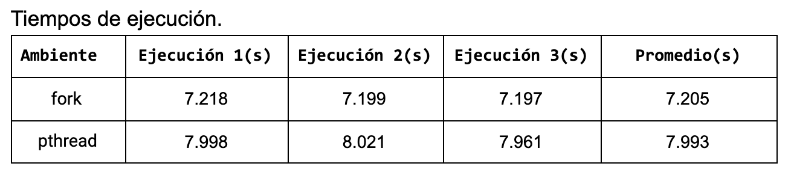

# Procesos vs. Hilos

En este directorio se encuentran algunos programas escritos en C que se usaron para validar que tan mal o que tan bien se comportan en cuanto a tiempo de ejecución los procesos versus los hilos. 
La teoría nos sugiere que los hilos se comportan mejor que los procesos y en este video muestro que tan cierta o falsa es esta  presunción.

Para encontrar una respuesta a esta inquietud se utilizó un programa intensivo en cómputo y es el cálculo del número de Fibonacci de forma recursiva. 
En el archivo [`fibo.c`](fibo.c) se encuentra dicha implementación.
Para comparar el rendimiento de los procesos con los hilos se usarán dos programas ([fibofork.c](fibofork.c) y [fibothreads.c](fibothreads.c)).
Cada programa calculará de manera recursiva 4 veces el número 45 de la serie de Fibonacci.  
Un programa creará 4 procesos ([fibofork.c](fibofork.c)) para hacer esta tarea y otro ([fibothreads.c](fibothreads.c)) creará 4 hilos para llevar a cabo  dicha tarea. 

La forma como se compilan todos los programas que se requieren para llevar a cabo esta tarea es con el comando:

```
make
```

Para ejecutar el programa que usa hilos, se usa el comando:

```
time ./fibothreads
```

Para ejecutar el programa que usa procesos, se usa el comando:

```
time ./fibofork
```

Un documento con más información respecto a hilos y procesos se puede encontrar en [este enlace](https://docs.google.com/document/d/1c1-BDV4xvANa2sPqWYh_007XCN0ClaauiF2QwGEMeB0/edit?usp=sharing).

Resultados que comparan la ejecución descrita anteriormente y ejecutada en una máquina virtual con 4 núcleos y 4 GB de RAM se puede ver en esta gráfica.

